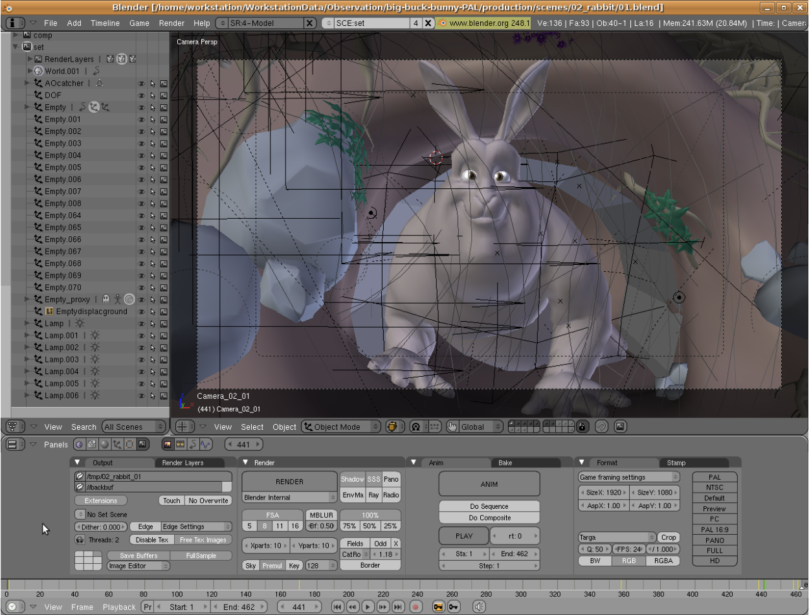

# Animation
<!-- Images
        

          

            

              

                

                  
                

                

                  
                

                

                  
                

              

            

          

        

-->
<!--
-->
<!--              <h3>Beginners</h3>-->
<!--              
<b>Pencil2D</b> is great for those that want to experience 2d hand-drawn animations and great for those just entered the field of animations with it not having so many robust features that may confuse you and it being free to use.  -->
<!--              For your stylus pen any affordable one will most likely work but we mainly recommend <b>Adonit Dash 2</b> a pen that is affordable but with the downside of not having some of the features a more expensive pen would, still a great stylus pen for those wishing to test the waters with animations in general.  -->
<!--              Now lastly for beginners is the trusty device you will be sketching out all your animations on. We would recommend you to use any device you own to start out with as to not spend any on something that might later just turn into a hobby. As long as that device is compatible with such animation software and pen you will be good to go, but mainly you would look for a tablet when you want to animate. -->
<!--              
-->
<!--            
-->
<!--            
-->
<!--              <h3>Intermediate</h3>-->
<!--              
Now another free software for those who are not beginning out, but also not sure if they want to take on animation full time Is <b>Blender</b>, it is a great software that will let you experience rigging, modeling, motion tracking, rendering and more. It is great for those that may not be ready for the more complex and advanced animation softwares out there.  -->
<!--              A good stylus pen for those that want their budget to be within 3 digits would be the <b>Wacom KP504E Pro Pen 2</b> that allows for 60 levels of tilt recognition, 8192 levels of pressure sensitivity, virtual lag free tracking and much more. Overall it is a great stylus for those that want a pen within 3 digits.  -->
<!--              A great tablet for those who wish for a moderate price is the <b>Kamvas Pro 16</b> with its large screen,high resolution and with it being able to be easily carried around. Overall a great tablet for those that have interest in having animation play a part in their life. -->
<!--              
-->
<!--            
-->
<!--            
-->
<!--              <h3>Expert</h3>-->
<!--              
<b>Adobe Animate</b> is a great overall software that allows you to use multitudes of  techniques such as 2D, hand-drawn, frame-by-frame, and as well as puppet animation.  Overall it is a great software for those that are experts when it comes to animation with all its variety of features that is worth it’s price.   -->
<!--              For your stylus pen we have the <b>Wacom Bamboo Ink Plus</b>, a great pen with a wide variety of features that can help make a professional's time pleasant and simple. A great pen that may take 3 hours to fully charge but can last up to 10 days even when regularly used. And like many well made styluses it comes with tilt support and like the apple pencil it detects how it's being held and translates placement into on screen strokes.   -->
<!--              The <b>Wacom Cintiq</b> that combines pen and display for a seamless experience and which feels completely natural. It also comes with a variety(16.7 million colors)  of vibrant colors for you to choose from in which you can see every detail of your creation on screen.-->
<!--              
-->
<!--            
-->