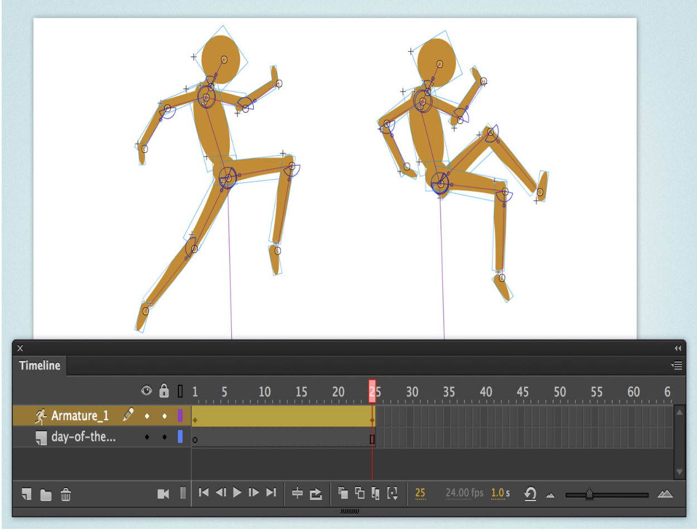

# Animation
<!-- Images
        

          

            

              

                

                  
                

                

                  
                

                

                  
                

              

            

          

        

